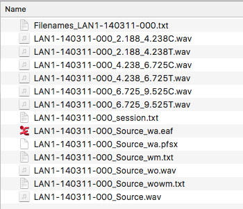
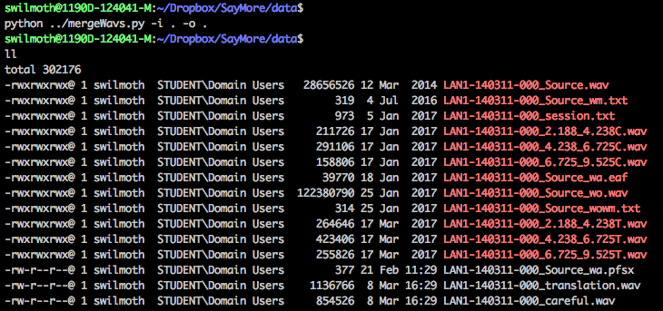

# mergeWavs.py
## Introduction

SayMore is a piece of software developed by SIL that (among other things) allows you to annotate a primary audio file with audio annotations. This means that speakers can add information by carefully re-speaking an utterance, or giving an oral translation. However, this becomes a problem because each annotation segment is saved as a separate file, which means you have to manage or archive hundreds or even thousands of 1-2 second audio files.

Simon Allen (Appen) has written a script which concatenates these short snippets according to their timestamps relative to the primary audio file, with silence in between. This file can then be added as a linked media file in ELAN, so you can switch to listen to that channel if you want to hear the oral translation or careful re-speaking at a particular point.

The script will work on Linux and Mac (it might work on Windows but has not been tested). It has only been tested with Python 2 but could be easily adapted to Python 3.
 
The script also makes use of the SoX program/command. See 'Troubleshooting' if you're getting errors related to this.

## Usage

mergeWavs.py takes a single directory as input, and outputs one or two wav files (careful speech or oral translation as applicable). The contents of the input directory might look something like this:


Each file starts with the same session name, in this case LAN1-140311-000. (You can even have multiple sessions in one folder, and it will work across all of them, as long as the filenames have the same 'stem'). The recordings of careful speech and oral translations include the start and end times in the filename, and end with a 'C' or 'T' respectively. The script uses this information to output two wav files (…translation.wav and …careful.wav). This is what it looks like when I open up the folder in Terminal, run the script, and check the contents of that directory:



I navigated to this directory by using the 'cd' command:

```
cd ~/Dropbox/SayMore/data`
```

(Hint: on a Mac, you can just drag the little folder icon at the top of an open Finder window into the terminal, and it will copy out the path.)

The command I used above is:

```
python ../mergeWavs.py -i . -o .
```

And these are its component parts:
- I saved the script in the folder above the current location (`~/Dropbox/SayMore`), so I find it by going 'up' with `../`
- The input folder is specified after a `-i` option. In this case, I was already working in the directory with my data so I specify it with a full stop `.`, but I could also put the full path: `-i ~/Dropbox/SayMore/data`
- Likewise, the location where I want the script to output the two wav files is specified after a `-o` option. I wanted the output to appear in the same folder, but I could have put any location.

## Troubleshooting
If you follow the above instructions and get an error message containing this line:

```
sh: sox: command not found
```

then it means you don't have SoX installed (SoX is a bit of software that converts audio between different formats). It already comes on most Linux machines. Installing SoX on a Mac is as simple as typing the command:

```
brew install sox
```
If that doesn't work, you can try downloading it from [here](https://sourceforge.net/projects/sox/files/sox/14.4.2/sox-14.4.2-macosx.zip/download).

You can check which version of Python you have on your computer with the command:

```
python --version
```

If you prefer to use Python 3 and this script isn't working, please email swilmoth at appen dot com.